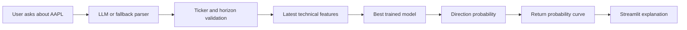

# AAPL Stock Outlook Assistant

An end-to-end ML capstone project that predicts Apple Inc. (`AAPL`) next-week stock direction and presents the result through an LLM-powered Streamlit interface.

The application is for learners and analysts who want an educational example of how a trained model, experiment tracking, testing, and a natural-language interface can work together. It is not financial advice.

## What The App Does

Users ask questions such as:

```text
What is the outlook for AAPL next week?
```

The system:

1. Parses the natural-language request into structured fields.
2. Validates that the ticker is supported by the trained model.
3. Builds the latest AAPL market features.
4. Loads the best MLflow-tracked model artifact.
5. Predicts whether AAPL is likely to close higher over the next 5 trading days.
6. Displays the probability, expected return estimate, uncertainty band, and a bell-curve-style return distribution.

## Project Structure

```text
.
|-- README.md
|-- requirements.txt
|-- Dockerfile
|-- .dockerignore
|-- .env.example
|-- configs/
|   `-- config.yaml
|-- src/
|   |-- download_data.py
|   |-- preprocess.py
|   |-- train.py
|   |-- evaluate.py
|   |-- interface.py
|   `-- app.py
|-- scripts/
|   `-- bootstrap_app.py
|-- tests/
|   |-- test_preprocess.py
|   |-- test_model.py
|   `-- test_interface.py
|-- data/
|   `-- .gitkeep
|-- models/
|   `-- .gitkeep
`-- reports/
    `-- .gitkeep
```

## Setup

Create an environment with Python 3.11 or newer, then install dependencies:

```bash
python -m pip install --upgrade pip
pip install -r requirements.txt
```

Configure the optional LLM API key:

```bash
copy .env.example .env
```

Set `NEBIUS_API_KEY` in `.env` or in your shell environment. If no key is present, the app uses a deterministic local parser and response template so the demo and tests still work.

## Data

Download AAPL historical daily market data:

```bash
python src/download_data.py --config configs/config.yaml
```

Data comes from `yfinance` and is saved to `data/aapl_daily.csv`. Raw data is excluded from Git.

## Training And Experiments

Train all configured models and log the runs to MLflow:

```bash
python src/train.py --config configs/config.yaml
```

The training script:

- Generates technical features from AAPL OHLCV data.
- Uses a time-aware train/test split to avoid leakage.
- Trains at least five model configurations.
- Logs hyperparameters, data description, metrics, and model artifacts to MLflow.
- Saves the best model artifact to `models/best_model.joblib`.

Compare experiments and identify the best run:

```bash
python src/evaluate.py --config configs/config.yaml
```

Launch the MLflow UI:

```bash
mlflow ui --backend-store-uri mlruns
```

## Run The App

Start Streamlit:

```bash
streamlit run src/app.py
```

Try:

```text
What is the outlook for Apple next week?
Will it go up next week?
```

Edge-case demo examples:

```text
What is the outlook for ARCC next week?
What will AAPL do next month?
```

## Docker

Build and run the app:

```bash
docker build -t aapl-stock-outlook .
docker run --rm -p 8501:8501 aapl-stock-outlook
```

To use Nebius in Docker, pass `NEBIUS_API_KEY` with `--env-file .env` or `-e NEBIUS_API_KEY=...`.

The container starts through `scripts/bootstrap_app.py`. On a fresh clone, it downloads AAPL data and trains the model inside the container before launching Streamlit. If you run with `--rm` and no mounted volumes, those generated artifacts are removed when the container exits. To reuse artifacts across runs, mount `data/`, `models/`, and `mlruns/` as Docker volumes.

## Architecture



## Features And Target

The model uses historical market activity such as:

- Lagged daily returns
- Moving-average ratios
- Rolling volatility
- RSI
- Intraday range
- Close-to-open movement
- Volume changes and volume ratios

The target is:

```text
1 if AAPL adjusted close is higher 5 trading days later, else 0
```

## Evaluation

The project reports classification metrics appropriate for the task:

- Accuracy
- Precision
- Recall
- F1
- ROC-AUC
- Majority-class baseline metrics

The expected performance goal is to compare honestly against a naive baseline and beat it where feasible. Stock prediction is noisy, so the project does not claim high accuracy.

Current best MLflow run after training on downloaded AAPL data:

```text
Run name: gradient_boosting
Run ID: 257186ceb36445bb85a76e3b585251ee
Accuracy: 0.5175
Precision: 0.5673
Recall: 0.6130
F1: 0.5893
ROC-AUC: 0.5112
Baseline accuracy: 0.5647
```

The best model slightly beats the naive baseline on ROC-AUC, but not on accuracy. That result is plausible for noisy stock direction forecasting and should be discussed in the final reflection/demo.

## Testing

Run the full test suite:

```bash
pytest tests/ -v
```

The tests cover:

- Missing value handling
- Feature creation and numeric ranges
- Preprocessing immutability
- Feature column selection
- Model prediction shape/type
- Minimum sample performance
- Natural-language parsing
- Missing, unsupported, and out-of-scope input handling

## Version Control

Data files, model artifacts, reports, MLflow runs, virtual environments, and secrets are excluded from Git. Keep only reproducible code, config, tests, and documentation in the repository.

## Reflection

This project demonstrates how an MLOps workflow can be connected to a user-facing LLM interface. The most important modeling challenge is avoiding data leakage and setting realistic expectations for financial forecasts. With more time, the project could add DVC data versioning, scheduled retraining, external market features such as `SPY` or `QQQ`, and richer uncertainty estimation through quantile regression or bootstrap simulations.
